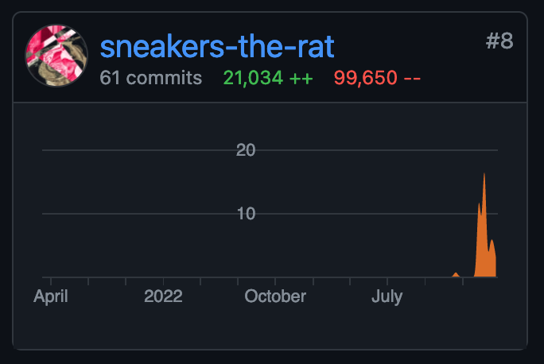
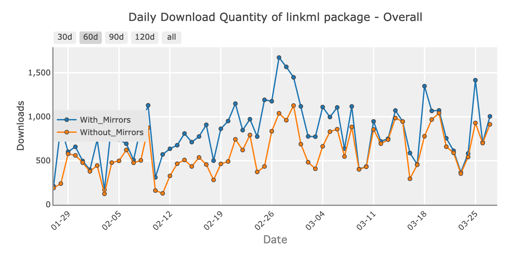

# FOSS Chronicles

To do what I did in like one week, 
it took two months of building good will and clean up technical debt to integrate in shared code.

Of just the PRs that have been merged...

*but it's worth it, because collaborating makes good code that gets used*

Linkml is a relatively small package, but still...

## `linkml/linkml`

All my LinkML PRs from the workshop (Feb 5-7) to now (March 27th)

* [`#2036`](https://github.com/linkml/linkml/pull/2036) - [pydanticgen] Embed extra metadata in modules, classes, and fields
* [`#2032`](https://github.com/linkml/linkml/pull/2032) - [QoL] Pretty print - main package version
* [`#2028`](https://github.com/linkml/linkml/pull/2028) - Automatically PR to update poetry lockfile v2
* [`#2023`](https://github.com/linkml/linkml/pull/2023) - Automatically PR to update poetry lockfile
* [`#2021`](https://github.com/linkml/linkml/pull/2021) - Add compliance tests to docs!
* [`#2019`](https://github.com/linkml/linkml/pull/2019) - [pydanticgen] Simplify pydantic generator serialization method
* [`#2018`](https://github.com/linkml/linkml/pull/2018) - Make compliance tests fail and skip
* [`#2004`](https://github.com/linkml/linkml/pull/2004) - Move sort classes from python generators to linkml-runtime
* [`#2002`](https://github.com/linkml/linkml/pull/2002) - Update lockfile
* [`#2001`](https://github.com/linkml/linkml/pull/2001) - [pythongen] Simplify slot generation iterators
* [`#1992`](https://github.com/linkml/linkml/pull/1992) - Make pyshacl an `extra`
* [`#1991`](https://github.com/linkml/linkml/pull/1991) - Make docs dependencies optional and in a separate group
* [`#1990`](https://github.com/linkml/linkml/pull/1990) - Include python version in CI cache key
* [`#1982`](https://github.com/linkml/linkml/pull/1982) - Cast rdflib Namespace instances to strings when used as base for contextgen
* [`#1980`](https://github.com/linkml/linkml/pull/1980) - [docker] Fix error from `COPY` .git directory by using `ADD`
* [`#1976`](https://github.com/linkml/linkml/pull/1976) - [tests] Remove test outputs and GeneratorTestCase
* [`#1969`](https://github.com/linkml/linkml/pull/1969) - Replace metamodel with kitchen sink in script tests
* [`#1967`](https://github.com/linkml/linkml/pull/1967) - Remove `validator.loaders` - move to `linkml-runtime`
* [`#1957`](https://github.com/linkml/linkml/pull/1957) - Add deprecations model and add deprecation warnings for pydantic v1
* [`#1954`](https://github.com/linkml/linkml/pull/1954) - Unbreak the docs & test them
* [`#1949`](https://github.com/linkml/linkml/pull/1949) - Cache network requests during tests
* [`#1941`](https://github.com/linkml/linkml/pull/1941) - [QoL] Make generating output optional in compliance tests
* [`#1940`](https://github.com/linkml/linkml/pull/1940) - Deprecate SQLDDLGenerator and change references to SQLTableGenerator
* [`#1939`](https://github.com/linkml/linkml/pull/1939) - [QoL] Quiet warnings
* [`#1938`](https://github.com/linkml/linkml/pull/1938) - [bugfix] generalize test for #494 after linkml-runtime 1.7.2
* [`#1927`](https://github.com/linkml/linkml/pull/1927) - [pydanticgen] Modularize template
* [`#1921`](https://github.com/linkml/linkml/pull/1921) - [perf] Mark shex generator as slow, skip except for gh actions runner
* [`#1918`](https://github.com/linkml/linkml/pull/1918) - Add timeout to requests
* [`#1916`](https://github.com/linkml/linkml/pull/1916) - [pydanticgen] Inject imports, slots, and classes
* [`#1887`](https://github.com/linkml/linkml/pull/1887) - [pydanticgen] Add lists of lists array implementation

## `linkml/linkml-runtime`

* [`#317`](https://github.com/linkml/linkml-runtime/pull/317) - [schemaview][bug] Pass imports as kwarg to all_slots
* [`#316`](https://github.com/linkml/linkml-runtime/pull/316) - Add action to test with upstream linkml
* [`#314`](https://github.com/linkml/linkml-runtime/pull/314) - pretty print models
* [`#313`](https://github.com/linkml/linkml-runtime/pull/313) - Add inheritance ordering, unify element ordering
* [`#312`](https://github.com/linkml/linkml-runtime/pull/312) - Make tests fail, not print
* [`#311`](https://github.com/linkml/linkml-runtime/pull/311) - Run tests once
* [`#310`](https://github.com/linkml/linkml-runtime/pull/310) - Fix `linkml_files`
* [`#307`](https://github.com/linkml/linkml-runtime/pull/307) - [perf] Use local schemas if available
* [`#306`](https://github.com/linkml/linkml-runtime/pull/306) - [perf] Use yamllib if available
* [`#305`](https://github.com/linkml/linkml-runtime/pull/305) - Consolidate loaders
* [`#304`](https://github.com/linkml/linkml-runtime/pull/304) - Optimize `get_classes_by_slot` round 2
* [`#302`](https://github.com/linkml/linkml-runtime/pull/302) - Fix `Schemaview.import_closure` order
* [`#296`](https://github.com/linkml/linkml-runtime/pull/296) - [perf] Remove unnecessary `deepcopy` calls in `Schemaview.induced_slot`

## `linkml/linkml-model`

* [`#177`](https://github.com/linkml/linkml-runtime/pull/177) - Add missing oslc and bibo prefixes
* [`#176`](https://github.com/linkml/linkml-runtime/pull/176) - Make `maximum_value` and `minimum_value` accept `linkml:Any`

## `linkml/prefixmaps`

* [`#69`](https://github.com/linkml/prefixmaps/pull/69) - Cut call time of `add_prefix()` by 99.8%

## `cmungall/json-flattener`

* [#7](https://github.com/cmungall/json-flattener/pull/7) - Close files