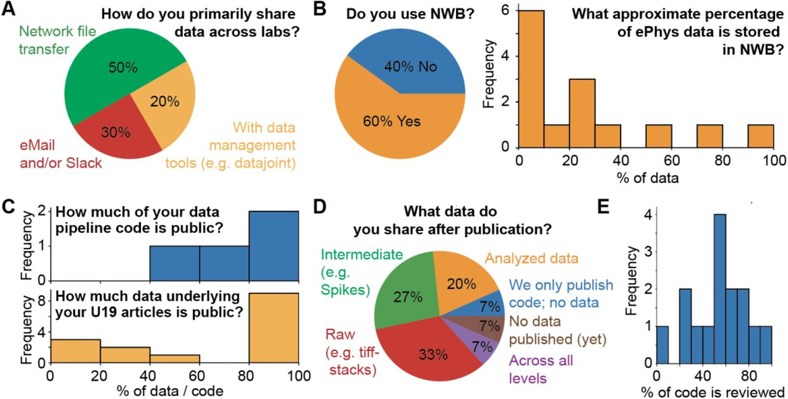

# Intro

## The State of Open Data: Not Great

> **August 2022 OSTP Memo:** *"Get Ready For All Data To Be Public"*
> 
> **Scientists**: *"lmao"*

## U19 Survey

Among active U19 projects (71% surveyed)...

> "In practice, **most data is copied through local networks or exchanged via eMail or Slack.** 
> Little data is shared with data management tools (Fig. 2A).
> When asked about such specific tools, like Neurodata without Borders (NWB),
> we discovered that these are well known and used in a majority of collaborations. 
> However, only a small fraction of data is maintained in these formats."
> {cite}`schottdorfDataScienceIts2024`

## Format Usage




```{footbibliography}
```

## The Conversion Spaghetti

What does it take to use NWB, and why is it this...

All of Catalyst Neuro's ["lab-to-nwb" repos](https://github.com/orgs/catalystneuro/repositories?language=&q=to-nwb&sort=&type=all)...

### Repos

```
IBL-to-nwb              giocomo-lab-to-nwb      oconnor-lab-to-nwb
MICrONS-to-nwb          higley-lab-to-nwb       pinto-lab-to-nwb
ahrens-lab-to-nwb       hussaini-lab-to-nwb     sabes-lab-to-nwb
allen-oephys-to-nwb     jaeger-lab-to-nwb       sargolini-to-nwb
axel-lab-to-nwb         jazayeri-lab-to-nwb     seidemann-lab-to-nwb
brody-lab-to-nwb        kriegstein-lab-to-nwb   shenoy-lab-to-nwb
brunton-lab-to-nwb      leifer-lab-to-nwb       shuler-lab-to-nwb
buffalo-lab-to-nwb      lerner-lab-to-nwb       soltesz-lab-to-nwb
buzsaki-lab-to-nwb      lin-lab-to-nwb          stavisky-lab-to-nwb
clandinin-lab-to-nwb    mease-lab-to-nwb        tank-lab-to-nwb
datta-lab-to-nwb        mousev1-to-nwb          tolias-lab-to-nwb
dombeck-lab-to-nwb      movshon-lab-to-nwb      turner-lab-to-nwb
fee-lab-to-nwb          murthy-lab-to-nwb       tye-lab-to-nwb
feldman-lab-to-nwb      najafi-2018-nwb         visual-coding-to-nwb-v2
froemke-lab-to-nwb      nelson-lab-to-nwb       x-to-nwb
```

### Lines of Code

```
-----------------------------------------------------------
Language             files      blank    comment       code
-----------------------------------------------------------
Python                 629      11254      10842      50912
Jupyter Notebook        64          0      42912       7635
Text                    70         19          0       4818
YAML                   158        128        131       4636
Markdown                78       1339          0       4294
JSON                    10         21          0       3842
TOML                    16         21          0        421
CSV                      2          0          0         94
Bourne Again Shell       1          5          0         19
MATLAB                   1          6          8         18
Bourne Shell             1          5          1         14
INI                      1          4          0         14
-----------------------------------------------------------
SUM:                  1031      12802      53894      76717
-----------------------------------------------------------
```

## Problems

Major data formats are not useful during an experiment

- too **hard** to use
- too **inflexible** to customize
- too **opaque** to understand

data formats are a *burden,* something to *convert to* after an experiment,
not something that *supports you* during an experiment.