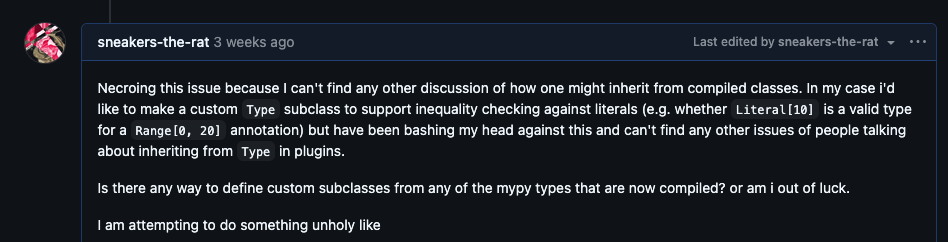
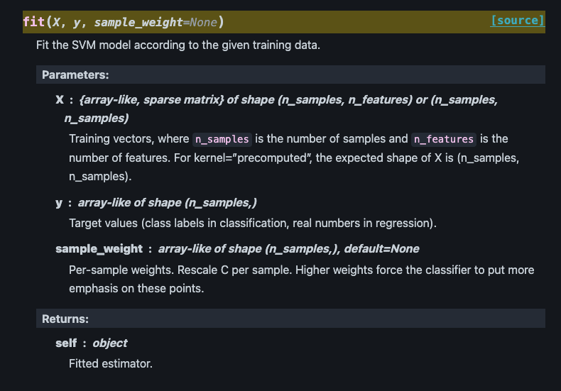
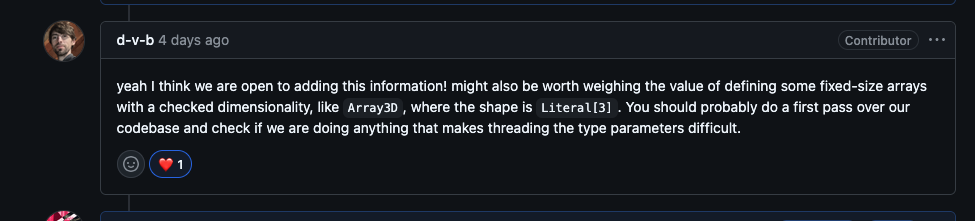
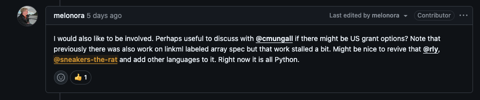

# Overview {background-image="background.jpg"}

- Background linkml stuff
- Numpydantic: static type checking for arrays too!
- Putting noob in mio: current status
- Noob experiments...


# Linkml Background {data-stack-name="LinkML"}

Numpydantic started as a way to implement linkml arrays.

:::: {.columns}

::: {.column width="50%"}
e.g. given this:

```yaml
MyCoolArray:
  attributes:
    the_array:
      range: integer
      array:
        minimum_number_dimensions: 5
        maximum_number_dimensions: false
        dimensions:
        - maximum_cardinality: 5
        - minimum_cardinality: 2
        - minimum_cardinality: 2
          maximum_cardinality: 5
        - exact_cardinality: 6
```

:::

::: {.column width="50%"}

get this

```python
class MyCoolArrayy(BaseModel):
    the_array: NDArray[
        Shape[
            "*-5", # any size up to 5
            "2-*", # any size larger than 2
            "2-5", # between two and 5
            6,     # exactly 6
            "*",   # any size
            "..."  # infinity more dimensions
        ], int]
```

:::

::::

## New stuff - Json Schema Gen {data-stack-name="LinkML"}

The point of linkml is interoperability across frameworks,
so added e.g. [json schema gen](https://github.com/linkml/linkml/pull/3622)

```json
{ "$defs": {
  "MyArray": { "properties": {
    "the_array": {
      "maxItems": 5, "minItems": 2, "type": "array",
      "items": {
        "maxItems": 6, "minItems": 6, "type": "array",
        "items": {
          "anyOf": [
            { "items": { "$ref": "#/$defs/MyArray-the_array-anyshape" }, "type": "array" },
            { "type": [ "integer", "null" ] } ]
  }}}}},
  "MyArray-the_array-anyshape": {
    "anyOf": [
      { "items": { "$ref": "#/$defs/MyArray-the_array-anyshape" }, "type": "array" },
      { "type": [ "integer", "null" ] } ],
  },

```

## Old stuff - `extra_slots`

NWB has a ton of unspecified "container" types without fields,
but with constraints on the "extra" fields.

So to make that work, added [`extra_slots`](https://github.com/linkml/linkml-model/pull/205) (in 2024):

:::: {.columns}

::: {.column}

```{.yaml code-line-numbers="1-3|4-9|10-13"}
MyClass:
  extra_slots:
    allowed: true

  extra_slots:
    range_expression:
      any_of:
      - range: str
      - range: integer

  extra_slots:
    range_expression:
      range: AnotherClass
```

:::

::: {.column}

1. Allow any extra values
2. Allow any extra values that are strings or integers
3. Allow any extra values that match another Class's schema

:::

::::

##  New Stuff - `extra_slots` implementations

Now it's actually implemented in [json schema](https://github.com/linkml/linkml/pull/2940) and [pydantic](https://github.com/linkml/linkml/pull/3630)

:::: {.columns}

::: {.column}

```json
{ "$defs": {
  "ExtraAllowed": { "additionalProperties": true },
  "ExtraAnyOf": {
    "additionalProperties":{
      "anyOf":[
        { "type": "string" },
        { "type": "integer" },
        { "type": "null" }
      ]
  }},
  "ExtraClass": {
    "additionalProperties": {
      "anyOf":[
        { "$ref": "#/$defs/Other" },
        { "type": "null" }
      ]
}}}}
```

:::

::: {.column}

```python
class ExtraAllowed(BaseModel):
    model_config = ConfigDict(extra = "allow")

class ExtraAnyOf(BaseModel):
    __pydantic_extra__: dict[str, int | str]
    model_config = ConfigDict(extra = "allow")

class ExtraClass(BaseModel):
    __pydantic_extra__: dict[str, Other]
    model_config = ConfigDict(extra = "allow")
```

:::

::::

## E.g. with NWB

"Dynamic Tables" get some index and columns as fields.

:::: {.columns}

::: {.column width="35%"}

```yaml
DynamicTable:
  extra_slots:
    range_expression:
      any_of:
      - range: VectorData
      - range: VectorIndex
      - range: Any
        array:
```

:::

::: {.column width="65%"}

```python
class DynamicTable(ConfiguredBaseModel):
    model_config = ConfigDict(extra="allow", validate_assignment=True)
    __pydantic_extra__: dict[str, VectorData | VectorIndex | NDArray]

# make some table
table = DynamicTable(
    index = VectorIndex(value=[1, 2, 3]),
    a_column = VectorData(value=[3, 4, 5]),
    another = np.array((6, 7, 8))
)

# then a row is like
>>> table[1]
{
  'a_column': 3,
  'another': 6
}
```

:::

::::


# Numpydantic {data-name="Numpydantic"}

~ static type checking baby ~

## Why Is Static Type Checking Good? {data-stack-name="Numpydantic"}

~ strict constraints make for programming that is correct by design not correct by accident ~

~ compiled languages force this strictness, with dynamic languages we have to enforce it on ourselves ~

## The Python Type System is a Thief Of Joy {data-stack-name="Numpydantic"}

::::{.columns .fragment}

::: {.column width="35%"}

- arbitrary array backends with convenient shorthands

:::

::: {.column width="65%"}

```python
>>> z = MyModel( video = "./data.avi")
>>> z.video.max()
error: "Path" has no attribute "max"  [attr-defined]
```

:::

::::

::::{.columns .fragment}

::: {.column width="35%"}

- extended constraint syntax

:::

::: {.column width="65%"}

```python
>>> x: NDArray[Shape["1-5", 3, "*"]]
error: Invalid type: try using Literal[3] instead?  [valid-type]
```

:::

::::

::::{.columns .fragment}

::: {.column width="35%"}

- compatibility with basic array ops

:::

::: {.column width="65%"}

```python
>>> x: NDArray[Shape[3, 3, 3]] = np.ones((3, 3, 3))
error: Incompatible types in assignment
(expression has type "ndarray[tuple[Any, ...], dtype[float64]]",
variable has type "ndarray[_Shape[Literal[3], Literal[3], Literal[3]], dtype[Any]]")

```

:::

::::

::::{.columns .fragment}

::: {.column width="35%"}

- General enough that we don't get pwned by differences between array backends

:::

::: {.column width="65%"}

```python
>>> x: np.ndarray | zarr.Array = np.ones((3, 3, 3))
>>> x.max()
error: Item "Array" of "ndarray[tuple[Any, ...], dtype[Any]] | Array"
has no attribute "max"  [union-attr]
```

:::

::::

## Enter: Mypy plugin

So what if it's impossible to do what we want with the python type system,
we have the power of plugins and anime on our side

```python
def analyze_grayscale(frame: NDArray[Shape["*, *"], np.uint8]) -> None:
    pass

x = np.ones((3, 3, 3), dtype=np.uint8)

>>> reveal_type(x)
note: Revealed type is "numpy.ndarray[tuple[Literal[3], Literal[3], Literal[3]], numpy.uint8]"

>>> analyze_grayscale(x)
error: Argument 1 to "analyze_grayscale" has incompatible type
"ndarray[tuple[Literal[3], Literal[3], Literal[3]], numpy.uint8]";
expected "ndarray[tuple[int, int], np.uint8]"  [arg-type]
```


## Constructor inference

Basic problem: make the shape available during static analysis.

Can be done by wrapping array construction in annotated type and using type system:

```python
@overload
def read_video(resolution: L["1080p"], color: L[True]) -> NDArray[Shape["1080, 1920, 3"]]: ...
@overload
def read_video(resolution: L["720p"], color: L[True) -> NDArray[Shape["720, 960, 3"]]: ...
@overload
def read_video(resolution: L["1080p"], color: L[False]) -> NDArray[Shape["1080, 1920"]]: ...

def read_video(resolution: str, color: bool) -> NDArray: ...
```

but also want to be able to "organically" infer from array creation

```python
np.ones((3, 3, 3), dtype=np.int16)
zarr.zeros((3, 3, 3), dtype=np.float64)
da.full((3, 3, 3), fill_value=10, dtype=np.uint8)
```

## Interface typing declarations

:::: {.columns}

::: {.column}

Each interface declares how to infer from its constructors

```python
class DaskTyping(InterfaceTyping):
    """Static-typing companion for :class:`DaskInterface`."""

    constructors = (
        ConstructorSpec(
          fullname="dask.array.zeros",
          shape_arg = 0
          dtype_arg = "dtype"
        ),
        ConstructorSpec(fullname="dask.array.ones"),
        ConstructorSpec(fullname="dask.array.empty"),
        ConstructorSpec(fullname="dask.array.full"),
    )
```

:::

::: {.column .fragment}

Intercept constructor typecheck

```python
spec = self._functions.get(fullname)
if spec := self._constructors.get(fullname):
    return _make_function_hook(spec)
```

Extract literals from dastardly mypy API

```python
>>> shape_expr
<mypy.nodes.TupleExpr object at 0x110899060>
>>> shape_expr.items
[<mypy.nodes.IntExpr object at 0x110898e80>, <mypy.nodes.IntExpr object at 0x110898fa0>, <mypy.nodes.IntExpr object at 0x110899000>]
>>> shape_expr.items[0].value
3
>>> TupleType([LiteralType(item.value) for item in shape_expr.items])
tuple[Literal[3], Literal[3], Literal[3], fallback=int]
```


:::

::::


## The Mypy api is decadent and depraved

Remember we have ranges

```python
class MyModel(BaseModel):
    array: NDArray[Shape["1-3", "4-6"]]
```

But [there is no way to create a custom type in mypy](https://github.com/python/mypy/issues/16497#issuecomment-4570099557)



## Sure I guess you could do it like that

So we just treat ranges as a subtype of the builtin string class and override its class equality operator
AND THAT SEEMS TO WORK!!!

Except equality is commutative!!!!

```python
class RangeValue(str):
    def __new__(cls, low: int | str, high: int | str): ...

    def __eq__(self, other: Any) -> bool:
        if isinstance(other, str) and _is_range(other):
            # TODO: figure out how to check if one range falls within another
            # can't tell if we're on the left or right side since associativity
            return True
        elif isinstance(other, int):
            low_valid = bool(self.low_wildcard or self.low <= other)
            high_valid = bool(self.high_wildcard or self.high >= other)
            return low_valid and high_valid
        else:
            raise TypeError("Can only compare integers or ranges to ranges")

```

## TODO: TypeVars

:::: {.columns}
::: {.column}
Arguably most of the time we care about whether shapes *match* but not exactly what they *are*

Every array function's docstring goes like this:
:::
::: {.column}

:::
::::

## Typevars 2


:::: {.columns}
::: {.column}
Almost got it!

E.g. what we want from pydantic models

```python
@NDArray
class MyDataset[M, N, T](BaseModel):
    frames: NDArray[Shape[T, M, N, 3], np.uint8]
    timestamps: NDArray[Shape[T], float]
    footprints: NDarray[Shape[M, N], float]
```
:::
::: {.column}

Or e.g. common array operations like multiplication

```python
def matmul[K, M, N](
    left: NDArray[Shape[N, K]],
    right: NDArray[Shape[K, M]]
) -> NDArray[Shape[N, M]]:
    return np.matmul(left, right)
```

or transposition

```python
def transpose[M, N](
    array: NDArray[Shape[M, N]]
) -> NDArray[Shape[N, M]]:
    return array.T
```

:::
::::

## TODO: Hooks

::::{.columns}
:::{.column width="40%"}
e.g. in mio we have semi-static shape data in config files

```yaml
id: wireless-200px
frame_width: 200
frame_height: 300
bit_depth: 8
```

which we use like this

```python
config = StreamDevConfig.from_id(
  'wireless-200px'
)
```
:::
:::{.column width="60%" .fragment}
Provide a hook like this:

```python
def get_shape(context) -> dict:
    # do something to get vals from the calling context
    config = StreamDevConfig.from_id(context.values[0])
    return {context.typevars[0]: config.frame_width,
            context.typevars[1]: config.frame_width}
```

So this works:

```python
>>> cam = StreamDev(id="wireless-200px")
>>> x = cam.read()
>>> reveal_type(x)
NDArray[Shape[Literal[300], Literal[200], np.uint8]
```
:::
::::

## TODO: Zarr and Dask annotations

- zarr is interested



- dask is uhhhhh


## TODO OME-Zarr integration & Labeled Arrays




# Mio/Noob {data-name="Mio/Noob"}

## tl;dr it's pretty much done

- Code for core loop is translated
- Spec is written as desired

TODO:
- trying to "use all the features" - nested tube/map needs some work

## Why the numpydantic detour

- the processing functions
- the exact case of "we have one main thing but also want to kind of glue some other stuff on"
- want to run both streaming and batched file mode
- lots of intermediate files and data and whatnot (diagram of the workflow)

# Noob Experiments {data-name="Noob Experiments"}

## That's right we rewrote it in rust

## Spiking Neural Net

- code changes needed
- SNN example diagram